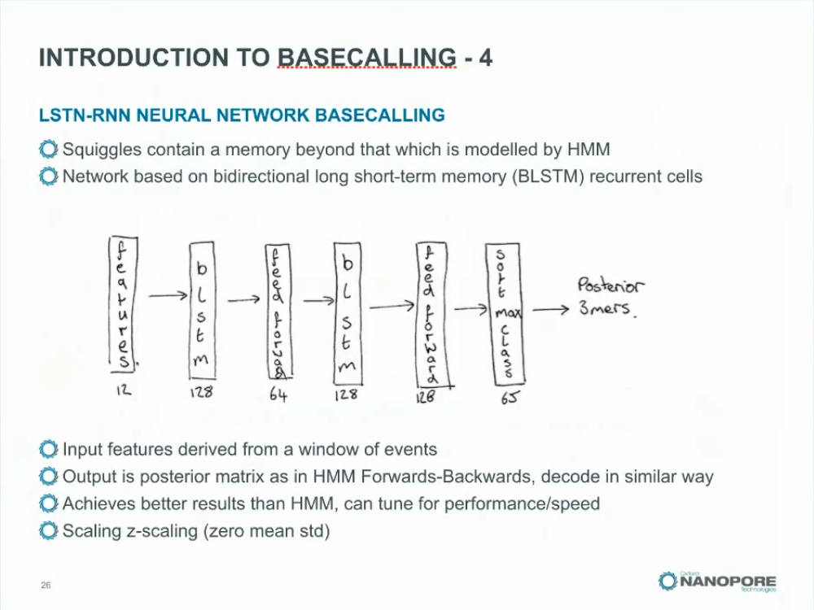
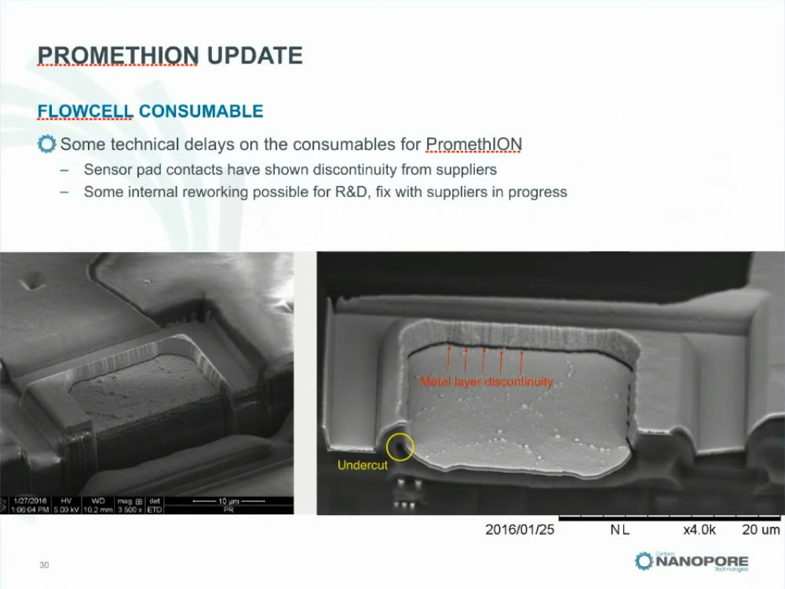
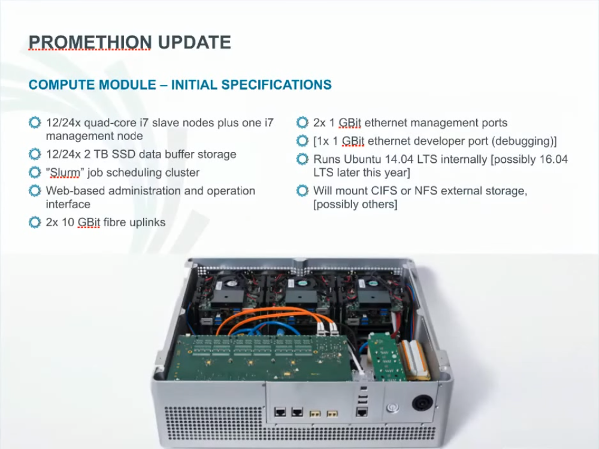

# "No Thanks, I've Already Got One"

* **Speaker: Clive Brown**
* **Video: [https://www.youtube.com/watch?v=nizGyutn6v](https://www.youtube.com/watch?v=nizGyutn6v)**

The purpose of this presentation is to give what you might call a *mezzanine update* (by which I mean sort of in-between update). There are a number of things we've been working on over the past few months — some of them are on-track and some are a little bit behind — and we have our major conference coming up later in the year, so timing-wise we wanted to give a very important intermediate update, and I'll be making a couple of quite significant announcements during this talk.

We're going to talk about some chemistry improvements that we're rolling out (imminently), and about some software releases, and I'm going to give very importantly a status update on PromethION. Obviously, you know that people have been waiting for and ordering that device for about 6 months now, so I think it's time to provide a detailed update for those people.

What I'm going to talk about today: our existing customers have had a lot of prior visibility of this via our support portal. If you're a Nanopore customer you get an account on our portal, and you can go on there and look at our latest stuff, and look at updates, and talk to me, so most of what I'm talking about today has been discussed in prospect on our portal.

We also have a thing called the developer license, I think there's about 20 people on it at the moment, and there's a special subgroup of people who have that license, and those people have more visibility of what I'm about to talk about. We've been discussing what I'm presenting today for about 6 months or so.

So first of all let's just recap what Nanopore sequencing is: again I'm pitching this talk at existing customers, people on the PromethION waiting list, and people thinking about becoming customers.

Nanopore sequencing is an old idea, going back at least 20 years (I'm not sure what the exact date is) and there's been an awful lot of background academic work on it over the past 20 years or so. Obviously, Nanopore has done a huge amount of work making it a viable commercial product over the last 8 years or so, and since we launched MinION about a year ago (perhaps a bit longer) there have been 40 papers.

The version of nanopore sequencing that we've embodied in our product for now is called *strand sequencing*, and what that means is, an intact, single strand of DNA is passed through a nanopore, that's in some sort of insulating membrane, and then we can sense current generated by an applied potential, across that pore as the DNA moves through the pore.

This is an old notebook sketch from professor [[David] Deamer](http://www.chemistry.ucsc.edu/faculty/singleton.php?&singleton=true&cruz_id=dwdeamer) that shows the outline of the idea - he's one of the original founding inventors of strand sequencing - on quite an old patent. The basic idea is we see deflections in current as bases transit the pore, and that's because the DNA provides a differential block on the current flow of ions induced by the applied potential.

And so we get a time series at the bottom here, and those deflections should reflect the compositions of the DNA. In reality it's a little bit more complicated, but in essence it's correct.

So in more detail, this is what we're looking at: a nanopore sequencer is a parallel array of this basic componentry. There is a membrane (which is an insulating membrane), and on each side of the membrane there is an aqueous solution of salt of some sort. But now the pore itself: now there's lots of pores that work, and we give them version numbers. So you're familiar with the jargon, we talk about R7, R8, R9, R10 - the R refers to a pore version. DNA naturally will transit the pore at a million bases per second, so we use a heavily engineered enzyme system that we've developed, that's pre-bound onto the DNA, so that forms a transient complex with the top of the pore, and brakes the DNA — it's a ratcheting brake — allowing us to measure at a much more sensible speed, like 200 bases per second.

The jargon versions we use for enzymes is *E*, and I think E7 is the latest version. We have different membranes, different membranes have different noise characteristics (M9 and M10 for example), it's another component which we can upgrade, on which we've done a lot of work. There are several components inside a strand nanopore sequencing system, but they're all subject to continuous upgrades, that's something we've been doing for a couple of years.

I think the first pore we went out with (not shown here) was R6, and I think within 2 or 3 months of that we transitioned into R7.

When we array those out (an array means a 2D collection of them) we have a bunch of single pores, in membranes, on a sensing system, and they work in parallel, and importantly they're not synchronised, they just operate at their own speed, they grab the DNA from solution, and each pore generates its own signal.

Underneath each pore, we have sensing circuits, very good signal-to-noise on them, very quick sensors, and those sensing circuits are inside this little grey square here, which is called an ASIC, which is another key component that we co-developed at Nanopore. Many people thought this was impossible, but there it is (ASIC is *application-specific integrated circuit*). So on the existing MinION that goes out there are 512 circuits, but they're looking at over 2000 nanopores, and that's because we have a switch in between the pores and circuits that lets us pick the best channel at runtime.

So, a single nanopore per well — you can have hundreds or [I'll talk later about] you can have [[hundreds of?]] thousands of channels, a channel is a pore and a circuit, and you can sense many analytes per pore per channel.

Importantly, a key differentiator of this system is that we sample molecules from solutions on a real time basis. Typically the sample is not attached to the system or flow cell, it's a sampling device from solution, which is important.

Here's the product that's available at the moment, this is the MinION, and I think people are pretty familiar with it now from Twitter I'd imagine, but it's a USB-powered, portable, low-cost DNA sequencer, this is a metal case and a heat sink, there's some connectors here, and sort of a single-board computer inside here that controls the sequencing, there's some insulation of various types to screen out any electrical noise. The action really occurs in what is called the flow cell, this thing at the top, this is the black thing with the snake-like output channel, this is the flow cell, and the yellow-y square is where the pores are, and the pores are sitting in the membrane in there, and the electronics is underneath that yellow square.

So a user puts the DNA sample in here, in liquid, they connect this to the device, and then software runs, pulls DNA through the pores, and we generate signals and decode them. That, in essence, is what the MinION does.

Again, just to recap — most people watching this will be familiar with this stuff, but I just want to cover the ground for new people — there are two basic ways we read the DNA, one is what we call *1D*, and all that means is, we measure the first template strand as it were, the forward strand of the DNA, as it goes through the pore, that's it. That's called 1D, single-pass.

The second type, called *2D*, and what gives it 2D is in the sample prep we've attached a hairpin to one end of the DNA, so what happens is we read the first strand, in other words there's a 1D step, the enzyme goes around the hairpin, and then reads the second strand. And then we combine both strands together when we come to decode the data. So there's the 1D version and the 2D version.

Now we're very keen on 1D, and importantly, it's where we want to go really, the 1D side, not least because we immediately double the throughput of the system by using 1D, but the sample preps we can apply to that are very simple, very quick, and themselves can be embedded in little portable devices of various types that we're working on.

So for example, I think it's not well understood out there (even though I talk about it every so often) that the read length you get out of this system is really proportional to the fragment distribution that you generate in the sample prep. I think every other sequencer, the read length is limited by the sequencing chemistry itself. In this case, it's the step before that, it's what you do the sample that generally gives you the read length distribution.

So a typical 2D would look like this histogram, the first one, with a mean of around 10 kb. You can move that mean around, depending on how you do your sample prep - some people have done longer, some people have done shorter ones, but with a 1D you get a distribution more like on the right hand side here. This is a transposase, and what it gives us is this sort of long tail of very long fragments. Not a bad median, and not a bad mean, typically in the tens of kilobase regions, using a transposase called MuA.

Now, what some people do - there are some platforms out there where they also generate these kinds of fragment distributions, and they then enrich the long fragments, using another screen, and you can do that with Nanopore as well. Of course the price you pay for that is you require more input DNA if you want to enrich up to these longer fragments.

There are probably versions of the MuA prep that, thinking about, would skew this distribution to the right anyway, but I think the key killer thing for it is its 10 minute sample prep. So, if you can lyse cells, or get DNA, and you can apply MuA, and you can get the resulting liquid into the flow cell, then on top of the real-time generation of full length reads, you can get very quickly from sample to answer in theoretically 15 minutes.

Somebody [ *Ed. : [Greninger et al., 2015](http://genomemedicine.biomedcentral.com/articles/10.1186/s13073-015-0220-9)* ] reported recently that from the time they introduced some viral DNA into the MinION, they were able to identify the virus within 4 minutes. So here's a 10 minute prep, with a few minutes of identification on it.

We have the upstream problem there of getting things out of cells. We're working on that, I don't think that's an intractable problem.

Now let's talk about throughput, probably one of the other most misunderstood results of multiplying numbers together is how much data you can get per unit time (which is what throughput is). Now we designed our sequencer to be fast, and probably the first thing I spoke about in 2012 was the ASIC and the speed of measurement of the ASIC.

It measures orders of magnitude quicker than the typical kind of CCD array you'll find in an optical camera-based system. Even though the number of channels is smaller, the speed at which you can measure is disproportionately quicker.

So for example, when we came out with the early access MinION, we were running DNA through between 10 and 100 bases per second. I think what people are running at the moment is about 70.

What I'm going to talk about in a minute is our initial first draft release of fast mode, which is where this pink dot is, where we're looking at running about 300 bases per second… But we know from other chemistries we've been playing with that we can do 500 bases per second, and indeed we've even got one that we've had up to 1,300 bases per second.

The ASIC electronics can deal with measuring at that kind of speed, at reasonable accuracy. The example I showed at *London Calling* last year was this very slide, so on 512 channels at 500 bases per second, the maximum you will get is 20 gigabases per day. After you run for 2 days, the maximum possible would be 40 gigabases from one flow cell. At 300 — actually I'm not sure what the number is there… I've got it later on — you can still get a considerable amount of data at 300 — well, you'll get 70% of 20 gigabases per day.

Now PromethION, which is coming along, has a different kind of flow cell, and that flow cel has a different ASIC, a newer ASIC, and that ASIC has 3,000 channels in it. So from PromethION at 500 [bases per second] we'd be expecting (from one PromethION flow cell) 120 gigabases *maximum* per day, and in total (at the top here) if we have all the PromethION flow cells running flat out at 100% efficiency (which never happens!) but the theoretical maximum would be 6.4 terabases per day.

Now we're going to talk about what's holding that theoretical throughput back, and how we're going to fix it a little bit later - but that's where a Nanopore sensing device can get to. And I made the point again at *London Calling* that in principle nanopore devices are very high throughput devices. I don't think people realised that when they were conceiving the idea of nanopore sequencing.

So speed of sensing for us has been key. So we have fewer things, but we're measuring them much more quickly, and the multiplication of numbers means that we do very well indeed.

So, we're going to come out with this 'fast mode', broadly available to everybody, and there are some kit updates that are required for you to be able to do that on the system.

The first one is this thing on the left, which is an R9 version of our sample prep, in other words it's compatible with the R9 pore, forwardly-compatible, and this does both 1D and 2D reads. There's a new enzyme in there — I think it's E7, can't remember — and you can do 250 — they've hedged it here… — it can actually give you 250 to 300 bases per second on this kit.

On the right hand side, broadly available, also completely compatible with R9, forwardly, is the transposome 1D kit, and that's the 10 minute kit. Two tubes, 10 minutes and we're done, and again that runs at 250 to 300 bases per second.

So both of those kits are coming out imminently. I have a timeline at the end that should make that clear for you. So first of all we're going to upgrade the kits.

I spent some time at *London Calling* trying to explain something that's really quite complicated, and if you're not an afficionado of nanopore sequencing, or a maths person, this might be tricky to understand…

…But the essence of it was that the pore and the controlling enzyme, as well as having behaviour in the 'block dimension' (that is, the deflection in current caused by the DNA), they also have interesting behaviour in the time domain, and historically we haven't really exploited that.

But, as I outlined again over a year ago, we've been looking at chemistry versions now that have what we call a non-exponential behaviour in the time domain - and what that means is you miss less. It means that you can measure more, and more quickly, and miss less. Things which are to the left of this dotted line you might miss, but things to the right you would not miss.

So the time domain behaviour of some of the newer chemistries is very good for us, because you just get more measurements of more things.

Again, as afficionados will know, the pore measures k-mers anyway (it measures 'short words'), so missing things isn't such a big problem anyway, but this just makes it much better, and having this non-exponential behaviour means that we can run things even quicker - we can run things really quickly - such that we don't really miss anything in informatics.

So it's all about speed. So we end up with the measurements of k-mers being more bunched around a commonly observed mean, than you would from say an exponential system, as I have on the far left here. And there are pore-enzyme combinations that are exponential, and there would be a more limiting speed problem on those systems. So we're moving towards these non-exponential time domain behaviours on our enzyme-pore combinations.

That's all great, so er… what kind of throughput did people really get…?

Well, it's limiting at the minute - this diagonal line on this graph shows how many G's [gigabases] you should be getting as the maximum over time, and there are some things eating into that. You can see that during a run — most people know this — people who run this know that the first 6 hours are the best, and then your cumulative output tends to tail off for various reasons as the run proceeds.

The big thing that is eating into that is what we call 'blocking', and it's a blocking behaviour that frankly seems to have appeared over the last 18 months, seems to be intrinsic to the current system that we're looking at, and some investigations have been done on this, and some investigations have been done on this.

People have also shown externally that for example PCR'd samples give more data at higher quality. People have shown that storing things in fridges tends to degrade both the throughput and the quality. It *looks like* damage to the DNA induces nicks in the DNA, that then somehow cause this degradation of throughput over time, as shown on the right hand side here.

We can now measure the problem, and we have a smoking gun candidate for what's causing it. A lot of work is now being done on removing this 50% loss after 24 hours, and I'm hoping that — I don't have anything to show today other than what we think the problem is, but there are various solutions for it — I'm hoping that we'll be able to talk about that quite definitively at *London Calling* later this year.

Then hopefully people will start to get the much much higher throughputs, the multiple gigabases per day, that are possible. Obviously, apart from what I'm going to talk about today, the next big issue is to resolve this little loss problem.

Now then - here's the biggie.

We've been working to improve the so-called 'accuracy', which is frankly a quagmire to talk about, not that many people really understand it, but I'll try and talk about it in terms that most people can relate to.

Looking at the pore that we've been working on, which is called R9, running at 250 bases per second (that's the bottom graph), using a Hidden Markov Model base caller… Now this Hidden Markov Model base caller has been the workhorse of base calling here for over 3 years, and it's the one that we run in the cloud. People who run through Metrichor will be familiar with what comes back, it comes through this HMM.

Now moving to R9, at 250 bases per second, all things being equal, we've been getting 1D and 2D accuracies as shown at the bottom here.

So on the HMM, the old caller, at 250 (it's actually a little bit higher than that, 260-270) we're getting the 1D's of around 75-80, and the 2Ds with a mean of around 90 or a bit less than 90.

However, we have been, thankfully, looking alternatively — having done an exhaustive study of what's causing error...

…we've been looking at some different kinds of base calls. So just to go back to that [previous] slide, there are some improvements here just from moving to R9, there's some chemistry improvements. But also, we've improved the data quality quite considerably, by using a different base caller framework, and in particular we've been looking at using these [recurrent neural networks](https://en.wikipedia.org/wiki/Recurrent_neural_network) [RNNs], that are quite popular with deep learning advocates, in particular a thing called [LSTM](https://en.wikipedia.org/wiki/Long_short-term_memory) [long short-term memory], and all that means is it's a neural network that can learn the signal but it can learn much more context.

So, because it's a biological system, we know there are little edge effects on the signal, that don't quite get captured by the HMM, that looks like these neural network systems are capturing these edge effects a little bit better.

This is still fairly preliminary, but on the latest R9 system at 250 bases per second, we're getting a 1D mean now of around 85, and a 2D mean of around 95% accuracy.

Now really, again, people who are customers who've been on the portal will know that I've been talking about this for a while. We're pretty confident now that we can release this as our first release, and this is the sort of baseline performance that we want to go out with - fast mode.

So, the sort of 'marketing hook' here is, the 1D is roughly equivalent to where, arguably, PacBio got traction, they may have improved since then ‒ I've no doubt ‒ and the 2D is now getting into the zone of capillary sequencing. The rate of improvement on this system, on the pore and the software, is such that I think everyone is very confident that within a few weeks or months, both of these distributions will have moved quite considerably to the right, and the target is to get the 2D into sort of 1% [probability of incorrect base call], Q 20 [[Phred quality score](https://en.wikipedia.org/wiki/Phred_quality_score)], and have the 1D at say, 10%, and I think the general feeling is that we can do that.

What's this R9 thing he's talking about? Well again, people who've been our customers will know that we've been talking about it for quite a while, I'm going to talk about what it is in a second, but here are some well known and published nanopores in section (at the top) and top-down view at the bottom, just to show people what we're dealing with with protein nanopores.

The crystal structures for these are all available, and fairly extensive publications for all of them, and there are other pores not shown here. There are pores for which there aren't crystal structures, there are pores where people have got them not yet published, and things in patent, and all sorts, but here are the 'usual suspects' in nanopores I suppose.

The relationship between shape and behaviour is a complicated one, and I think many years of PhD students trying to get to terms with that, we do it empirically, mostly.

See this pore on the right hand side here has basically this tube, though there are some narrow points in it, but it's a tube and you can get decodable signal out of that. This is the haemolysin pore, very well understood, it has these sort of open area, sort of 'tulip-shaped' with a tube. People have truncated this quite extensively, you can truncate the barrel, you can interchange subunits.

This is the MspA porin from *Mycobacterium smegmatis* here, which has this sort of funnel shape, with a little hole at the bottom, and this is CsgG, which is a pore that's been published for about 13 months I think, with a top-down view. This one is a sort of tube, with a what I suppose you'd call a flange in the middle of it.

I first spoke about R9 (which is a pore) at our *London Calling* conference in May of last year, and I said … and there's the slide, so the point about R9 is it's got a very different signal profile from R7, it's got a sharper reader head, it's more discriminating. We actually now think that most of the signal comes from 2 bases: it's a short word pore in principle, and it seems to have fewer long-range interactions compared to the R7 series, but even so that neural network is still learning those interactions better than the HMMs… and it's improving. That was R9 I spoke about.

So we're releasing R9 as a part of our fast mode update, and here is R9, it's the 'holey grail', hence the long-running and not very funny joke involving Monty Python. R9 is in fact the CsgG pore from *E. coli*, in fact this pore is found commonly in most Gram negative species — absent in the Gram positives, so you don't find it in *Mycobacterium* for example.

It's actually a lipoprotein, you can argue if that's different but I think it's different, it's not a pure protein it's a lipoprotein, and here are the various views of it. It's a beta barrel, with some squiggly alpha [helical] stuff on the top, and there's a top-down view. Again, here is a sectional view, and you can see it's a tube, with a constriction at a flange in the middle.

Again the wild-type has been published, and we have heavily engineered that pore now, with over 700 mutants, to give us a series of pores that we can release to customers.

We call it the 'holey grail' because the general consensus here, with all our experience in looking at nanopores, is that this pore has a very considerable degree of headroom for further improvement. We really like it as our backbone pore system.

Interestingly, it's got 9 subunits, R9, and R8 had 8 subunits.

Here it is, here's the CsgG lipoprotein, I've covered most of this, but give credit where it's due to VIB, which is over in Ghent, lab of Han Remaut (and others) published that [*[Goyal 2014](http://www.nature.com/nature/journal/v516/n7530/abs/nature13768.html)*], notably UCL. I know Ghent very well, very pretty Belgian town by the way if you want to go drink some beer and eat some *frites*, very nice, and we have a licence to this pore, an exclusive licence, to develop it for nanopore sequencing, to develop it for nanopore sequencing, which is what we've done.

In nature, it's interesting, its job in nature is to translocate and do things with peptides actually, and it's part of this biofilm formation that bacteria can do under some conditions, so obviously a peptide-translocating pore is of potential interest as well for protein sequencing. That's from a reference to the *Nature* paper at the bottom there [Goyal *et al.* (2014) [Nature 516(7530) 10.1038/nature13768](http://www.nature.com/nature/journal/v516/n7530/abs/nature13768.html)].

That is R9. So for the first time I've told people what the pore is, unambiguously.

Now here's the R9 release plan, as part of our fast mode release. We're aiming in March to release the source code for our base callers, so if you are on the developer licence, you will very soon indeed (possibly the next couple of days) have access to our entire base calling framework. Certainly the 1D HMM and the RNN source code.

People want to do local base calling, people want to develop base calling, this gives people a leg up, it makes things transparent, it might give people ideas for doing things better, it might come back and help us.

It's licensed under this developer licence because we don't want to help competition, we are a company, we're not academic. We're quite happy to be fairly open, we just don't want to damage ourselves by helping the competition, so have a look at the developer licence if you're interested in getting the source code for that.

For developers, we're coming out with the R9 flow cells during March, and the kits will be available as well during March, and then broadly things will be available shortly after, to everybody else.

And that developer licence is… you know what I think this slide is wrong… I should have looked at it, just ignore this slide, I've got a better one later on…

Take a look at the developer licence if you're a software person, it lets you get 'first dibs' on most of our stuff. We have things that we don't distribute broadly. Again, the base calling software will be downloadable from a GitHub repository on that licence, and there are other goodies in there as well.

Plus you can talk to some of our internal R&D people, and get an inside track on what's going on. If you don't like the licence terms, then you should talk to us. We can think about changing them to make them more flexible, but again the purpose of that licence is really to make things open, but to just protect us from competition.

The same...

Now... 

Let's talk about base calling.

So very briefly, these are some overview slides we've made. For a long time we've had this step called event detection, and what that does is it takes raw signal and it converts it into a reduced format, and the reduced format is to generate averages for sections of the data which are the same, effectively.

Now I have never liked it… I just don't like it. It runs using, basically, a t-test on a window, looking for a shift in the population of raw data samples in the signal. When you get that shift, you get a little t-test t statistic peak here, and then we peak find, and that's how we find the transitions. These transitions correspond to a single base move on the enzyme.

Then you have to hop through these measurements, and decode them into bases effectively. Now it breaks down in fast mode, certainly when you get over 500 bases, it starts to get ropey. It's in the current software and the current release, but we're looking to replace this with working directly from raw data as soon as possible.

It's another step that's sensitive to parameterisation, and all these other things. So, if we can get the neural networks and other methods working directly from raw samples, that would be a step forward, and that's a major focus of progress, but at the moment we do this event detection stuff.

The HMM then, so what we do is, we're going to release if you're on the developer portal, you'll see the entire model training and application process documented, as a first draft, and if there's missing detail we'll fill it in.

The basic process is you align loads of 'squiggles' to each other, so you have some sort of reference, and merge them all together, so they all fit nicely, with EM alignment.

You can then cross-label squiggles. You can then generate a model of k-mer vs. block level, and then you can have a transition model, effectively overlaps in the k-mers and use a [forward-backward algorithm](https://en.wikipedia.org/wiki/Forward%E2%80%93backward_algorithm) to decode a posterior algorithm on the 1D.

The 2D is more complicated obviously, which I'll talk about in a minute, but in essence we have to roughly combine two 1D's to get an approximate alignment, and then do a two-dimensional, or three-dimensional posterior decoding through a two-dimensional set of alignments.

Here it is, exactly what I just mentioned: and in fact it gets very computationally horrible, frankly. Another reason I don't like this very much… another reason to focus on 1D is that it gets big.

We use various tricks to make it smaller, we truncate that matrix to try and reduce the Viterbi. All of these things are probably non-optimal, although the guys have done a tremendous job of all this over the years.

But we're looking to simplify this obviously, and 1D of course cuts out this stuff completely, if you can work on 1D.

On the neural network I understand a little bit better because I've sort of 'built my own', but essentially we can do the same thing of aligning squiggles to get labels to squiggles. We can learn those with what's called a bi-directional LSTM. Then that can emit soft-max. posteriors on 3-mers actually, and then we can do some sort of Viterbi decoding on those posteriors as a final step, in what's sort of a hybrid HMM/RNN. That has given better results on 1D, for sure, than the HMM.

It's got some other useful things, for example the scaling is what's called z-scaling, it's just much… the workflow around it is generally just a bit simpler. It executes about as quickly as the HMM, quite variable depending on how you set up the network.

It's quite a hot area of research, neural networks, there's quite a lot being done on these LSTM things. The thing I'm — apart from getting event detection on the front, and using raw data — on the other end, I'm quite keen to use some other methods of dealing with the outputs, possibly something called CTC [*connectionist temporal classification*].

So this is quite an active area of research for us now. Again, the source code for that — we actually used some public packages for that as well as our own source code — the source code and the workflow around that will be released as part of the upcoming set of releases, so you should be able to recreate what we've done.

I'm going to skip that…

Now let's talk about PromethION!

So, I think at *London Calling* last year we introduced it, and we said we'll try and get the first box out by the year end. We haven't actually shipped a box to a customer yet at all, but it is pretty imminent, I would say, so let's talk about what's going on there.

So for those not familiar with PromethION, again it's a benchtop-y box, with 48 flowcells, and in total that gives you 144,000 channels (remember a channel is a nanopore plus a circuit), so it's got a lot of nanopores on it, but you can run one flow cell, you can run some of them, you can put one sample on one, you can put one sample on two, they can run for different times, you can flush them out… It's an incredibly flexible, easy to run system.

So, stacked for example, if you put a very big sample on all of them, you'd have the result very quickly. The way we've commercialised this, or are commercialising it, is such that it's capital-light, there's almost no capital as such. It's almost all, arguably, consumable-dependent…

…Which means that, if you're not using it, it's not costing you anything, in terms of depreciation and so forth. So, for a big lab I think it's ideal, for a core facility with very lumpy requirements it's very good as a proposition, and the throughput numbers are competitive with HiSeq (or HiSeq X).

Certainly once we've fixed that little shortfall on the throughput over time, the numbers should climb very quickly. You can sort of think about that a bit like (for those who remember) optimising cluster density on Solexa ([*before acquisition by*] Illumina), we have to optimise this yield over time issue to get the maximum out of the system.

But even in the worst case, there is a shedload of data from a relatively low-cost box.

Now PromethION only runs R9. It's not an R7 system — or R6 even… neither pore will be available on PromethION. PromethION is only slated to run R9, and it will only ship with R9 flow cells. At the moment we're running R9.2, I've a feeling by the time we get it might be R9.3, hopefully with some improvements.

At the bottom here, you can see the compute module, and this contains as you may have guessed, some computing. I'm going to talk about what that is in a minute, but it can do real-time analysis and on-line analysis.

It's basically a manageable cluster in a box. Let's have a look at that in more detail.

So I said it's a very modular system: 48 sensor chips and 48 flow cells. You can put 4 samples per chip, of course if you're [[DNA] barcoding](https://en.wikipedia.org/wiki/DNA_barcoding) more than that… 3000  channels per chip, up to 144,000 simultaneous channels.

Those kits I spoke about earlier, those are also set up to be forwardly-compatible with PromethION. Ligation kit, or the transposome kit - the 10 minute kit.

Contrary to what you may have read, you can now get away with very low sample inputs for nanopore sequencing, and again quite a lot of work is going on to reducing sample input requirements.

The device is designed to be amenable to parallel pipetting, so if you're doing your sample stuff in plates, it should be transferable directly onto a system, with very little fuss.

It's a little bit late, the boxes are fine, [but] we've had a little manufacturing issue with a part of the flowcell, I'm going to talk about that. So part of making the ASIC available to the chip requires an intermediate level of what you might call 'bonding electronics'.

The first version of that has come back with a defect. There's a gap in what's called the metal layer, which means there's no circuit there, and there's an issue with it. So we've had to respin(?) that, we've had to send it all back to the manufacturer and get it fixed, and that adds a delay. Largely responsible for why the first box hasn't gone out yet.

Little, very simple overview slide of architecture, very Mickey Mouse really.

We have a parallel array of flowcells, that contain a parallel array of independent sensing channels. There are computers inside the compute module, with servers on that are controlling and collecting data from those, and there's a job distribution system.

What that means is is that you can load share, if you're on-line base calling  from one flowcell, you can actually have multiple CPUs and many threads operating on that one flowcell, or *vice versa*. This is the obvious thing to do.

We base call those, the 1D's on-line, and then we write them out, either to locally attached storage — if you've got it network-attached storage, or you could fire off to cloud if you've got it. The sort of bog-standard default is a locally attached storage device.

We're proposing that 2D initially, 2D calling will be off-line (or 'post-run'), with 1D on-line. We hope to move to on-line 2D in the future, but we're not there yet. I think we need to simplify the 2D before we do that, or we get 1D to replace where it's so good most people don't really care about 2D, or if they do care about it they're quite happy to do it post-run.

Of course, you can 2D call on your own computers in real-time, nothing to stop you doing that. Very flexible the way we've set it up, basically.

Here is the compute module. It contains… really it's a cluster in a box.

The initial version has 12 quad-core i7 slave nodes, we're working on a version with 24 in one. There's 12x2 [TB SSD] — there's lots of storage in there for buffering of data. There's a 'Slurm' [*Simple Linux Utility for Resource Management*] job scheduler, for those of you who know what that is, it's all web [based], got a master node which lets you run everything via the web, and it's got two 10 GBit fibre uplinks out the back.

There's also some GBit [ethernet ports] on there, and it's running Ubuntu 14. It mounts CIFS and NFS, we may do others, but that's the baseline specification for the compute module. For some people it's important to know that.

Here are some PromethIONs in build, the one on the far left is by far the most advanced, effectively. This is effectively the first shipping system.

Here is our network-attached storage, no it doesn't need to be that big, that's just ours. The one on the far right here is the least advanced. We're initially building about 4 to 6 per month, but we're going to get to 10 per month later in the year. If you do the maths on that we can probably clear the existing backlog by year end. So that's good news for PromethION orders, we intend to have them all out by year end.

I think even if we have new orders, we'll probably be able to get most of those out by year end… everybody with an order in with at least one box by the year end, and there's capacity for more orders as well I think.

Now, if you are in the queue, and what I have said does not please you, we can refund deposits if you like, but that will mean you will lose your place in the queue, and somebody else will take it. Now would be a good time, now that you've got visibility of all the details, to talk to us about it.

PromethION starts with R9. The only pore it will run, when it ships, is R9. After that, there's an R10 in the background, but it starts with R9, that's the CsgG pore I mentioned earlier.

This is the slide I wanted. Much simpler. This is March, this timeline.

The source code for base callers will be available to developers imminently. The sequencing kits I mentioned earlier are probably within a week or two.

R9 flow cells, we would aim to start shipping those within a couple of weeks, and the rapid sequencing kits, thereabouts, couple of weeks.

Now there's a MinKNOW version coming, which is R9-compatible, and that's also probably going to come in a couple weeks' time. And then we're aiming to get the first PromethION out at the end of March, first customer, with R9.

I hope that's reasonably clear ‒ so it's all happening in March, is the basic essence. There's a batch of releases during March, give or take. Obviously, if we hit some kind of glitches in March, some things may slip, but there's a blob of stuff coming your way in March is the key message here.

So let me summarise what's happening — so we're transitioning everybody to R9.x some time in March, and when that's done, we will obsolete R7. Goodbye to R7, the same way we 'obsoleted' R6.

Now R9, in our hands, at the moment is giving us a mean 85% 1D and mean 95% 2D, and it's improving very rapidly. It's the way forward, as far as we're concerned, in particular because it enables that 1D utility — for most people not everybody. For most of our customers we know that's important.

PromethION shipping end of March first customer, only with R9. It's an R9 system.

Now we're doing base caller source code releases under Developer License imminently, and… off you go, basically. But also, I think it's April I've got it slated down, there will be an integrated local base caller in MinKNOW, hopefully in April. So if you're not on the Developer License, and somebody else doesn't write some software for you, you will have a local base caller in MinKNOW, roughly speaking in April. Certainly before *London Calling* happens.

So there's two local base callers, there's a source code one, on the Developer [License], and there's a non-source code one that will be integrated with MinKNOW. The source code one is coming first.

Now Fast Mode, as I said, the big one is Fast Mode, is in March. On R9, at 250 to 300 bases per second, and what will then happen is, over time, we will increase the speed to 500 bases per second, but initially we're going out with, say, 280. That still gives you a lot of data.

Our target is, our build plan, is to clear the PromethION backlog by year end.

So that hopefully covers the news in this talk, in outline. There will be a full update, and a bunch of new features spoken about at our *London Calling* conference in May, so I'm not talking about everything today, just about the things which are pertinent at the moment. There's a bunch of other stuff coming your way in May.

Also, I would hope that our experts — the people who've written the base callers, and the people who've done the sample preps — can give some quite detailed seminars at *London Calling* later in the year.

Also hoping that by releasing R9 and the base callers, some of our developer-type customers will have developed some of their own stuff to talk about, that's new and exciting, in time for *London Calling*.

Just a reminder that our big conference is *London Calling*, 26-27 May, open to all, and that's when we do most of our major updates rather than minor updates, like we've done today.

Let me go back to that summary slide just to really hammer it home… If it wasn't clear from the other slides, we're tranisitoning to R9 during March, and when that's done we will say goodbye to R7.

At the moment we're getting 85% 1D and 95% 2D, and that will improve. PromethION will ship end of March we think, only with R9. We're doing a base caller source code release under a Developer License, and then later, probably April, an integrated local base caller in MinKNOW for everybody else.

Fast Mode is now being released in March as part of that, it's at 280 bases per second, but we intend to move it to 500 bases per second in the future — probably over the summer.

Engineers are confident with the build plan we have, we will clear the PromethION order backlog by year end.

Finally just to remind everyone about the *London Calling* conference in May. And with that I will attempt to stop, and see if I can get my face on the screen. So I think we're going to stop there, and I'm going to take some questions from our customers via our portal.

… see also

* [http://www.bio-itworld.com/2015/11/19/oxford-nanopores-software-side.html](http://www.bio-itworld.com/2015/11/19/oxford-nanopores-software-side.html)

* [http://biorxiv.org/content/biorxiv/early/2016/02/03/038760.full.pdf](http://biorxiv.org/content/biorxiv/early/2016/02/03/038760.full.pdf)

